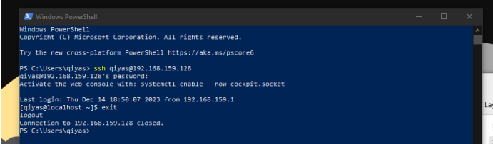
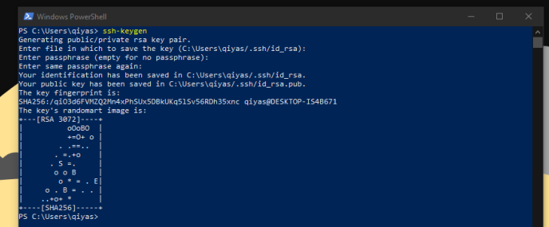
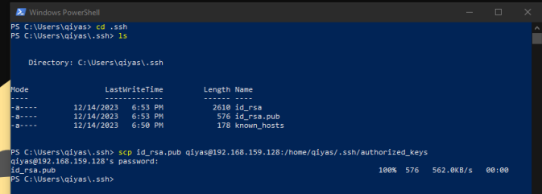
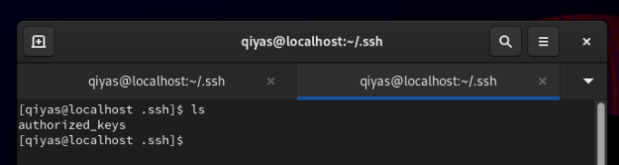
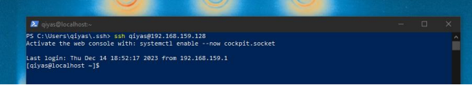

# ssh-windows-linux
Windows-dan Linux serverə şifrəsiz, SSH açar faylı ilə təhlükəsiz bağlanma təlimatı.
# Windows → Linux SSH Key Authentication

> **Windows**-dan **Linux** serv#  Windows → Linux SSH Key Authentication

> **Windows**-dan **Linux** serverə şifrəsiz, **SSH açar faylı** ilə təhlükəsiz bağlanma təlimatı.

---

##  Mündəricat

- [Ümumi məlumat](#ümumi-məlumat)
- [Tələblər](#tələblər)
- [Addım 1 — SSH bağlantısını yoxla](#addım-1--ssh-bağlantısını-yoxla)
- [Addım 2 — SSH açar cütü yarat](#addım-2--ssh-açar-cütü-yarat)
- [Addım 3 — Public açarı Linux serverə köçür (scp)](#addım-3--public-açarı-linux-serverə-köçür-scp)
- [Addım 4 — Şifrəsiz qoşulma](#addım-4--şifrəsiz-qoşulma)
- [Addım 5 — Öz adını verdiyin açar faylı ilə qoşulma](#addım-5--öz-adını-verdiyin-açar-faylı-ilə-qoşulma)
- [Vacib Qeydlər](#-vacib-qeydlər)
- [Linux → Linux üçün](#-linux--linux-üçün)

---

## Ümumi məlumat

Linux-dan Linux-a qoşularkən `ssh-copy-id` əmrindən istifadə olunur. Lakin **Windows**-da bu tool mövcud deyil (MobaXterm kimi proqramlarda daxili gəlir). Ona görə biz `scp` vasitəsilə açar faylını **əl ilə** köçürürük.

---

## Tələblər

| Tələb | Qeyd |
|-------|------|
| Windows PowerShell | SSH client aktiv olmalıdır |
| Linux server | SSH service işləməlidir |
| Şəbəkə əlaqəsi | Server əlçatan olmalıdır |

---

## Addım 1 — SSH bağlantısını yoxla

Əvvəlcə adi şifrə ilə bağlantının işlədiyini yoxla:

```powershell
ssh qiyas@192.168.159.128
```



Əgər qoşuldu — növbəti addıma keç.

---

## Addım 2 — SSH açar cütü yarat

Windows PowerShell-də `ssh-keygen` əmrini işlət:

```powershell
ssh-keygen
```

> Default olaraq açarlar `C:\Users\<username>\.ssh\` qovluğuna `id_rsa` adı ilə yazılır.



Bu əmr 2 fayl yaradır:

| Fayl | Məzmun |
|------|--------|
| `id_rsa` | **Private key** — heç kimə vermə! |
| `id_rsa.pub` | **Public key** — serverə göndərilir |

###  Özün ad vermək istəyirsənsə:

```powershell
ssh-keygen
# "Enter file in which to save the key" soruşanda: test
```

Bu zaman `test` və `test.pub` faylları yaranır.


---

## Addım 3 — Public açarı Linux serverə köçür (scp)

`.ssh` qovluğuna gir və `scp` ilə `.pub` faylını serverə göndər:

```powershell
cd C:\Users\qiyas\.ssh

scp id_rsa.pub qiyas@192.168.159.128:/home/qiyas/.ssh/authorized_keys
```

>  **Diqqət:** Faylın adı serverda mütləq `authorized_keys` olmalıdır!



Linuxda yoxla — fayl artıq oradadır:

```bash
ls ~/.ssh
# authorized_keys
```



---

## Addım 4 — Şifrəsiz qoşulma

İndi şifrə daxil etmədən qoşula bilərsən:

```powershell
ssh qiyas@192.168.159.128
```



 Artıq şifrəsiz bağlantı işləyir!

---

## Addım 5 — Öz adını verdiyin açar faylı ilə qoşulma

Əgər açar faylına özün ad vermisənsə (məs. `test`), `-i` opsiyonundan istifadə et:

```powershell
scp test.pub qiyas@192.168.159.128:/home/qiyas/.ssh/authorized_keys

ssh -i test qiyas@192.168.159.128
```


---

## Addım 6 — SSH Config faylı (tövsiyə olunur)

Hər dəfə uzun əmr yazmaq əvəzinə `~/.ssh/config` faylı ilə qısa alias təyin edə bilərsən.

**Windows:** `C:\Users\<username>\.ssh\config`  
**Linux/Mac:** `~/.ssh/config`

```
Host myserver
    HostName 192.168.159.128
    User qiyas
    IdentityFile ~/.ssh/test
```

İndi sadəcə bu qədər:

```powershell
ssh myserver
```

Birdən çox server üçün nümunə → [`config.example`](config.example) faylına bax.

---

##  Vacib Qeydlər

### RHEL 8 və daha aşağı versiyalar — Permission problemi

`scp` ilə köçürülmüş faylın permissionu **644** olur, lakin SSH **600** tələb edir. Əks halda fayl işləmir.

**Həll:**

```bash
chmod 600 ~/.ssh/authorized_keys
```

| Permission | İzah | İşləyir? |
|-----------|------|----------|
| `644` | Başqaları oxuya bilər | ❌ |
| `600` | Yalnız sahibi oxuya bilər | ✅ |

---

## 🐧 Linux → Linux üçün

Linux-dan Linux-a qoşularkən `ssh-copy-id` istifadə olunur:

```bash
ssh-keygen
ssh-copy-id salam@10.10.10.10
```

Bu əmr avtomatik olaraq public açarı qarşı tərəfin `~/.ssh/authorized_keys` faylına əlavə edir.

> Ətraflı: LMS-də Chapter 5 videolarına bax.

---

##  Repo strukturu

```
ssh-key-auth/
├── README.md
├── ssh_key.pdf        # Orijinal PDF təlimat
└── images/            # Screenshot-lar
```

---

##  Əlaqəli mövzular

- [OpenSSH documentation](https://www.openssh.com/manual.html)
- `man ssh-keygen`
- `man scp`

---

*Hazırladı: Qiyas | LMS Chapter 5 əsasında*
erə şifrəsiz, **SSH açar faylı** ilə təhlükəsiz bağlanma təlimatı.

---

## Mündəricat

- [Ümumi məlumat](#ümumi-məlumat)
- [Tələblər](#tələblər)
- [Addım 1 — SSH bağlantısını yoxla](#addım-1--ssh-bağlantısını-yoxla)
- [Addım 2 — SSH açar cütü yarat](#addım-2--ssh-açar-cütü-yarat)
- [Addım 3 — Public açarı Linux serverə köçür (scp)](#addım-3--public-açarı-linux-serverə-köçür-scp)
- [Addım 4 — Şifrəsiz qoşulma](#addım-4--şifrəsiz-qoşulma)
- [Addım 5 — Öz adını verdiyin açar faylı ilə qoşulma](#addım-5--öz-adını-verdiyin-açar-faylı-ilə-qoşulma)
- [Vacib Qeydlər](#-vacib-qeydlər)
- [Linux → Linux üçün](#-linux--linux-üçün)

---

## Ümumi məlumat

Linux-dan Linux-a qoşularkən `ssh-copy-id` əmrindən istifadə olunur. Lakin **Windows**-da bu tool mövcud deyil (MobaXterm kimi proqramlarda daxili gəlir). Ona görə biz `scp` vasitəsilə açar faylını **əl ilə** köçürürük.

---

## Tələblər

| Tələb | Qeyd |
|-------|------|
| Windows PowerShell | SSH client aktiv olmalıdır |
| Linux server | SSH service işləməlidir |
| Şəbəkə əlaqəsi | Server əlçatan olmalıdır |

---

## Addım 1 — SSH bağlantısını yoxlay;n

Əvvəlcə adi şifrə ilə bağlantının işlədiyini yoxlayın:

```powershell
ssh qiyas@192.168.159.128
```


Əgər qoşuldu — növbəti addıma keç.

---

## Addım 2 — SSH açar cütü yarat

Windows PowerShell-də `ssh-keygen` əmrini işlət:

```powershell
ssh-keygen
```

> Default olaraq açarlar `C:\Users\<username>\.ssh\` qovluğuna `id_rsa` adı ilə yazılır.


Bu əmr 2 fayl yaradır:

| Fayl | Məzmun |
|------|--------|
| `id_rsa` | **Private key** — heç kimə vermə! |
| `id_rsa.pub` | **Public key** — serverə göndərilir |

###  Özün ad vermək istəyirsənsə:

```powershell
ssh-keygen
# "Enter file in which to save the key" soruşanda: test
```

Bu zaman `test` və `test.pub` faylları yaranır.


---

## Addım 3 — Public açarı Linux serverə köçür (scp)

`.ssh` qovluğuna gir və `scp` ilə `.pub` faylını serverə göndər:

```powershell
cd C:\Users\qiyas\.ssh

scp id_rsa.pub qiyas@192.168.159.128:/home/qiyas/.ssh/authorized_keys
```

>  **Diqqət:** Faylın adı serverda mütləq `authorized_keys` olmalıdır!


Linuxda yoxla — fayl artıq oradadır:

```bash
ls ~/.ssh
# authorized_keys
```


---

## Addım 4 — Şifrəsiz qoşulma

İndi şifrə daxil etmədən qoşula bilərsən:

```powershell
ssh qiyas@192.168.159.128
```


 Artıq şifrəsiz bağlantı işləyir!

---

## Addım 5 — Öz adını verdiyin açar faylı ilə qoşulma

Əgər açar faylına özün ad vermisənsə (məs. `test`), `-i` opsiyonundan istifadə et:

```powershell
scp test.pub qiyas@192.168.159.128:/home/qiyas/.ssh/authorized_keys

ssh -i test qiyas@192.168.159.128
```


---

##  Vacib Qeydlər

### RHEL 8 və daha aşağı versiyalar — Permission problemi

`scp` ilə köçürülmüş faylın permissionu **644** olur, lakin SSH **600** tələb edir. Əks halda fayl işləmir.

**Həll:**

```bash
chmod 600 ~/.ssh/authorized_keys
```

| Permission | İzah | İşləyir? |
|-----------|------|----------|
| `644` | Başqaları oxuya bilər |  |
| `600` | Yalnız sahibi oxuya bilər |  |

---

##  Linux → Linux üçün

Linux-dan Linux-a qoşularkən `ssh-copy-id` istifadə olunur:

```bash
ssh-keygen
ssh-copy-id salam@10.10.10.10
```

Bu əmr avtomatik olaraq public açarı qarşı tərəfin `~/.ssh/authorized_keys` faylına əlavə edir.

> Ətraflı: LMS-də Chapter 5 videolarına bax.

---

## Repo strukturu

```
ssh-key-auth/
├── README.md
├── ssh_key.pdf        # Orijinal PDF təlimat
└── images/            # Screenshot-lar
```

---

##  Əlaqəli mövzular

- [OpenSSH documentation](https://www.openssh.com/manual.html)
- `man ssh-keygen`
- `man scp`

---

*Hazırladı: Qiyas *
